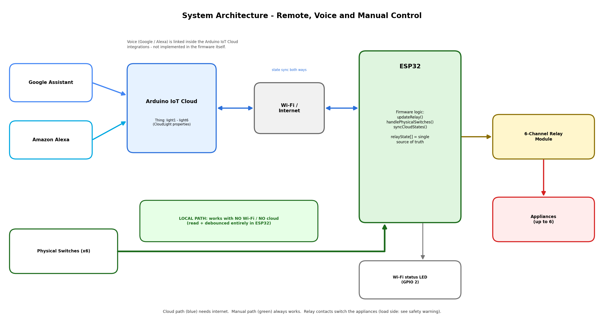

## 6-Channel ESP32 Smart Home Switch Controller

### Project overview

A 6-channel home automation controller built on an ESP32. Six relays switch appliances, and each has a physical wall switch. Appliances can be controlled remotely through **Arduino IoT Cloud** and by voice through **Google Assistant** and **Amazon Alexa**.

> **Remote and voice-based appliance control through Arduino IoT Cloud, with physical manual switches that continue to provide local control when Wi-Fi or cloud connectivity is unavailable.**

### Features

- 6 independent relay channels
- 6 physical switches, one per channel (momentary or maintained)
- Remote control through Arduino IoT Cloud (`light1`–`light6`)
- Voice control through Google Assistant and Alexa via Arduino Cloud integrations
- Software debounce (40 ms) on every switch
- Local control works with no Wi-Fi or cloud
- Cloud dashboard re-syncs with the real relay states after reconnect
- Wi-Fi/cloud status LED on GPIO 2
- Serial debug log at 115200 baud

### Hardware

| Component | Qty |
| --------- | --: |
| ESP32 development board (DevKit / WROOM-style) | 1 |
| 6-channel relay module (active-LOW by default) | 1 |
| Physical switches | 6 |
| Appliances | up to 6 |

Pin map: Relays on GPIO 23, 22, 21, 19, 18, 5. Switches on GPIO 32, 33, 25, 26, 27, 14. Status LED on GPIO 2. Details in [`docs/wiring.md`](docs/wiring.md) and [`hardware/components.md`](hardware/components.md).

### How the system works

`relayState[]` is the single source of truth. A change can arrive from the Arduino IoT Cloud callback or from a physical switch. Both go through `updateRelay()`, which drives the relay and keeps the cloud property in sync.

### Cloud control

Six `CloudLight` properties (`light1`–`light6`) map to the six relays. Changing one in the Arduino Cloud dashboard or app switches the matching relay. After every (re)connection, the ESP32 pushes its real relay states to the cloud.

### Voice control

Voice control uses the Arduino Cloud integrations for Google Assistant and Amazon Alexa with the Light-type variables. It is configured in Arduino Cloud and the Google Home / Alexa apps, not in the firmware. See [`docs/setup.md`](docs/setup.md).

### Manual / offline control

Each switch is read and debounced locally. Pressing a switch toggles its relay immediately, without waiting for Wi-Fi or the cloud. All relays start OFF after power-up; state is not stored across power loss.

### Architecture



Circuit diagrams: [`circuit/circuit_diagram.png`](circuit/circuit_diagram.png) and [`circuit/schematic.png`](circuit/schematic.png).

### Safety warning

> **If your relays switch AC mains, the load side is hazardous.** Have a qualified person do mains wiring, isolate power before working, use correctly rated parts, fuses and an insulated enclosure. This repository does not specify load voltage or current. Never commit Wi-Fi passwords, Device ID or Secret Key.

### Repository structure

```text
.
├── README.md
├── circuit/
│   ├── circuit_diagram.png
│   └── schematic.png
├── docs/
│   ├── architecture.png
│   ├── setup.md
│   └── wiring.md
├── hardware/
│   └── components.md
└── firmware/            (suggested location)
    ├── <sketch>.ino
    ├── thingProperties.h
    └── secrets.h        (add to .gitignore; use placeholders)
```

The firmware header refers to a "safe-pin rationale" in the README. If you keep that comment, add a short section explaining why the pins were chosen (avoiding strapping, flash and input-only pins).
